# EE542_final

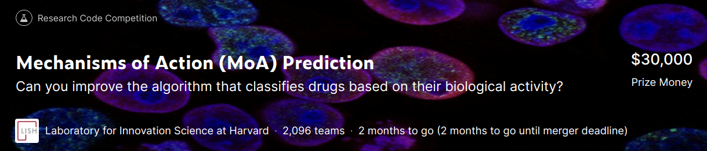

## Usage tutorial

Final project for EE542

Youtube video explanation and demonstration:  https://youtu.be/k4rnc9RrlwY

Our project is based on a Kaggle competition

[Mechanisms of Action (MoA) Prediction](https://www.kaggle.com/c/lish-moa/overview) Competition repository

- result
	- public: 0.01825
	- private: 0.01614

To run our scripts, several packages need to be installed first. 

It's best to run our scripts directly on kaggle platform because all packages we used are on that platform and those packages can be imported and installed directly through platform without the need of pre-installation on your computer. But still, you can run our scripts on other places as well and you probably need to pre-install these packages on your computer. 

Here's a list of packages we used: (you can search the name and import into your data folder if you use Kaggle)

1. https://www.kaggle.com/c/lish-moa/data
2. https://www.kaggle.com/ludovick/pytorch16gpu
3. https://www.kaggle.com/vikazrajpurohit/tabnet-smoothing
4. https://www.kaggle.com/vikazrajpurohit/iterative-stratification-tabnet
5. https://www.kaggle.com/ludovick/tabnetdevelop
6. https://www.kaggle.com/yasufuminakama/iterative-stratification
7. https://www.kaggle.com/vikazrajpurohit/moa-5seed

Do like this:

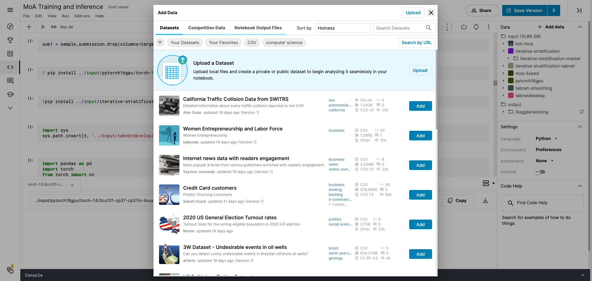

## Overview

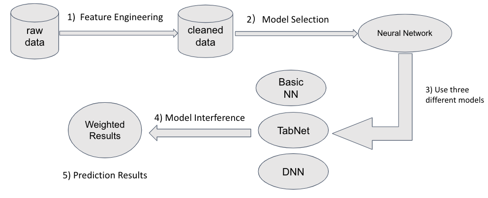

## 1) Feature Engineering

For feature engineering, besides basic feature statistics, we use RankGauss + PCA + VarianceThreshold. 

### Raw Data: 

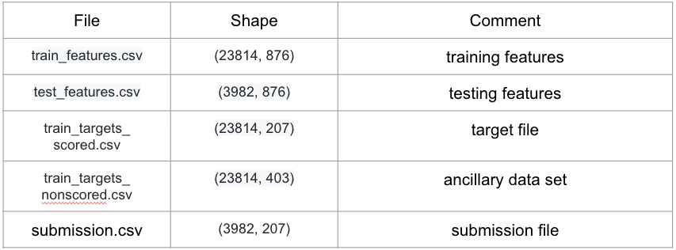

### Basic Feature Statistics: 

cp_type:

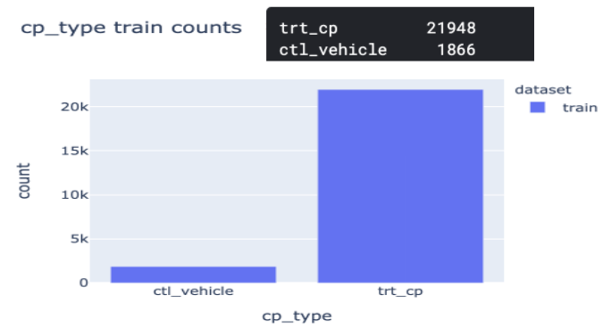

gene data:

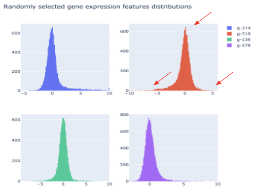

cell viability data:

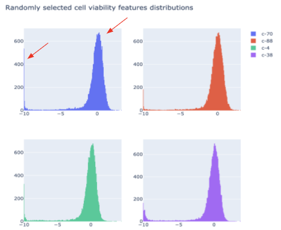

Number of target classes that each sample has:

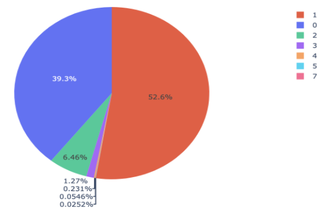

10 largest number of labels in the scored targets:

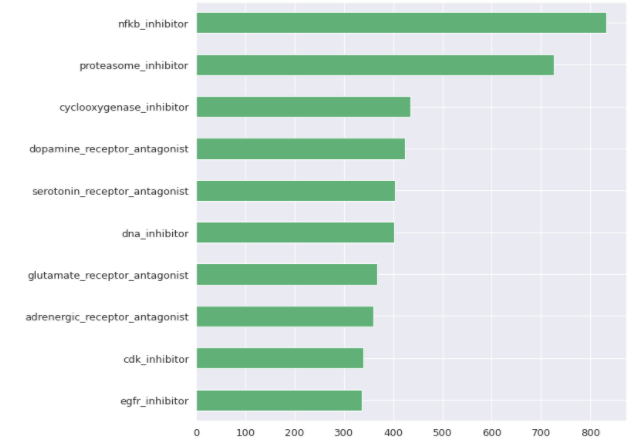

RankGauss: (Before and After)

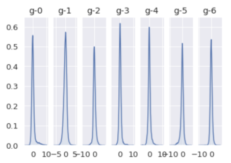

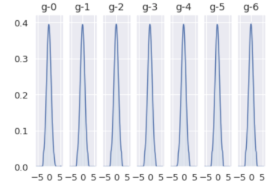

We then set number of genes to be 600 and cells to be 50 after PCA. 

We set Variance Threshold to be 0.8.

## 2) Models Used

### Model 1

Our structure of model 1 is as follows:

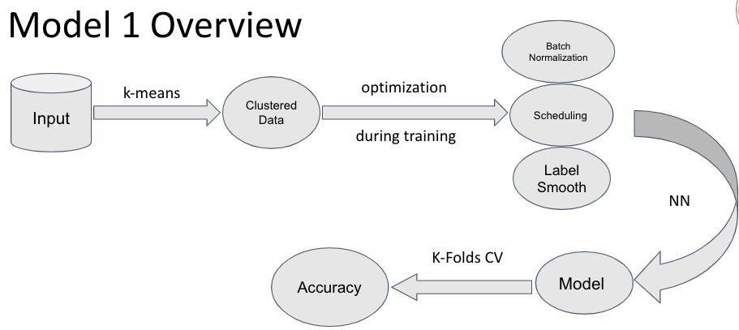

Results:

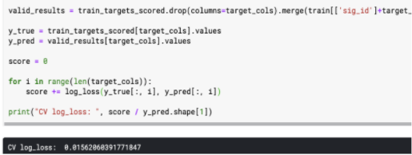

### Model 2

Our structure of Model 2 is as follows:

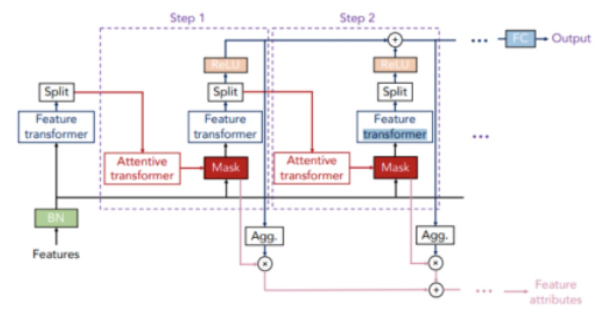

Results:

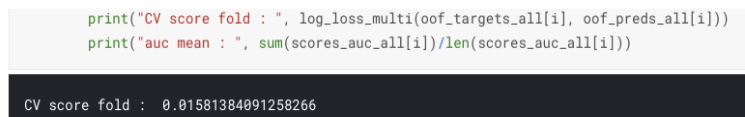

### Model 3

* 5-layer DNN model
* 4-layer DNN model
* 3-layer DNN model
* 2-layer DNN model 
* Resnet-type model

Do the blending altogether.

Result:
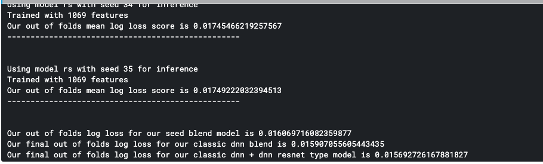

## 3) Model Ensemble

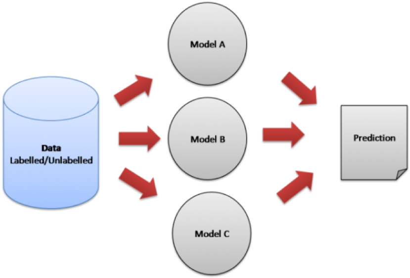

Do the model blending with different weights.

## 4) Final Result

