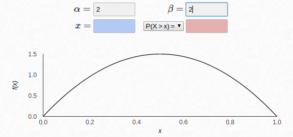

# EE542_final
! [comp] (./data/info/readme/001.png)
# kaggle-Mechanisms-of-Action-MoA-Prediction
[Mechanisms of Action (MoA) Prediction] (https://www.kaggle.com/c/lish-moa/overview) Competition repository

--result

    --public: 0.01822

    --private: 0.01609

    --rank: 39/4373

Top 1% !!!!    
Mostly thanks to my friends! !! !!

  


## Basics
Mechanism of Action (MoA) means a specific biochemical interaction for a drug to exert its pharmacological effect. ([Reference] (https://ja.wikipedia.org/wiki/mechanism of action))

### info
-[googledrive] (https://drive.google.com/drive/u/1/folders/1JGawvjsXcoTEVL_VHkRvE1J7-UclvA7u)
-[issue board] (https://github.com/fkubota/kaggle-Mechanisms-of-Action-MoA-Prediction/projects/1)
--Important person

| name | detail |
| --- | --- |
| [mrbhbs] (https://www.kaggle.com/mrbhbs/discussion?sortBy=latestPost&group=commentsAndTopics&page=1&pageSize=20) | Host. Often seen in comments in discussions about domain knowledge. |
| [Michael Maguire] (https://www.kaggle.com/thawatt/discussion?sortBy=latestPost&group=commentsAndTopics&page=1&pageSize=20) | A master who asks good questions to the host. |

### Paper
| No. | Status | Name | Detail | Date | Url |
| --- | --- | --- | --- | --- | --- |
01 | Todo | TabNet: Attentive Interpretable Tabular Learning | TabNet Original Paper | 2020 | [url] (https://arxiv.org/abs/1908.07442) |
| 02 | Done | A novel method for classification of tabular data using convolutional neural networks | A TAC treatise that uses CNN for table data. 2020 | [url] (https://www.biorxiv.org/content/10.1101/2020.05.02.074203v1.full) |
02 | Todo | Focal Loss for Dense Object Detection | Original paper on focal loss | 2017 | [url] (https://arxiv.org/abs/1708.02002) |

### Overview (DeepL)
Connectivity Map, a project within MIT and Harvard Broad Institute, Harvard Institute for Innovation Science (LISH), and NIH Common Funds Library of Integrated Network-Based Cellular Signatures (LINCS), promotes drug development through improved MoA prediction algorithms. We are presenting this challenge with the aim of moving forward.

What is the mechanism of action (MoA) of medicines? And why is it important?

In the past, scientists have derived drugs from natural products and have been inspired by traditional remedies. Very common medicines such as paracetamol, known in the United States as acetaminophen, were used clinically decades before the biological mechanisms driving their pharmacological actions were understood. Today, with the advent of more powerful technologies, drug discovery is shifting from past serendipitous approaches to more targeted models based on an understanding of the biological mechanisms underlying the disease. In this new framework, scientists seek to identify disease-related protein targets and develop molecules that can regulate those protein targets. As an abbreviation to describe the biological activity of a particular molecule, scientists assign a label called mechanical-of-action or MoA for short.

How is the new drug MoA determined?

One approach is to treat a sample of human cells with a drug and then similarities to known patterns in a large genomic database, such as a library of gene expression and cell viability patterns for drugs with known MoA. Analyzing the cellular response using a search algorithm.

The competition gives you access to a unique dataset that combines gene expression and cell viability data. This data is based on a new technique that simultaneously (in the same sample) measures the response of human cells to drugs in a pool of 100 cell types (in this way, which cell type for a drug). It solves the problem of pre-determining if it is more suitable). In addition, you have access to MoA annotations for over 5,000 drugs in this dataset.

As is customary, the dataset is divided into a subset of tests and training. Therefore, your challenge is to use the training dataset to develop an algorithm that automatically labels each case in the test set as one or more MoA classes. Note that this task is officially a multi-label classification problem, as drugs can have multiple MoA annotations.

How to evaluate the accuracy of the solution?

Based on the MoA annotation, the accuracy of the solution is evaluated based on the mean value of the log loss function applied to each drug-MoA annotation pair.

If successful, you will contribute to the development of algorithms that predict the MoA of the cell-signed compound, helping scientists advance the drug discovery process.

### Data Description (DeepL)
The contest predicts multiple targets for the mechanism of action (MoA) response of different samples (sig_id) given different inputs such as gene expression data and cell viability data.

There are two caveats.

The training data has an additional (optional) set of MoA labels that are not included in the test data and are not used for scoring.
Rerun datasets are about four times as many as the examples found in public tests.

train_features.csv --Training set features. cp_type indicates a sample treated with a compound (cp_vehicle) or controlled perturbation (ctrl_vehicle), the controlled perturbation has no MoA. cp_time and cp_dose indicate the duration of treatment (24 hours, 48 ​​hours, 72 hours) and dose (high or low).
train_targets_scored.csv --Binary MoA targets to be scored.
train_targets_nonscored.csv --Additional (optional) binary MoA reaction for training data. These are neither predicted nor scored.
test_features.csv --Features of test data. We need to predict the probability of scored MoA for each row of test data.
sample_submission.csv --Correctly formatted submission file.


### input

| filename | file size | shape | comment |
| ---- | --- | --- | --- |
| sample_submission.csv | 3.2M | (3,982, 207) | --- |
| test_features.csv | 25M | (3,982, 876) | This dataset is exactly equal to the public dataset. private is four times the size of public. |
| train_features.csv | 150M | (23,814, 876) | --- |
| train_targets_nonscored.csv | 19M | (23,814, 403) | --- |
| train_targets_scored.csv | 9.7M | (23,814, 207) | --- |

** train_fatures.cv **
--shape: (23814, 876)
--cp is an abbreviation for compound

| columns | detail |
| --- | --- |
| sig_id | drug type |
| cp_type | Indicates whether it was treated with a compound or a controlled perturbation. It takes a binary value of cp_vehicl or cp_ctrl. Control perturbations (cp_ctrl) do not have MoA. |
| cp_time | Processing time. It takes three values ​​of 24, 48 and 72. |
| cp_dose | Dose. Two types, D1 and D2 (high, low). |
| g-[0, 771] | signify gene expression data. mRNA data. |
| c-[0, 99] | signify cell viability data. Represents cell viability. |

## features

## Log
### 20201006
--join
--data download
--data size list


--nb001
    --EDA of input data was performed

### 20201007
--Today, I added input to my kaggle diary.
--I read this [EDA] (https://www.kaggle.com/isaienkov/mechanisms-of-action-moa-prediction-eda) notebook.

### 20201008
--I saw the usual [Ikeike EDA] (https://www.kaggle.com/headsortails/explorations-of-action-moa-eda) of Mr. Galaxy.
    --Treatment features

        
    
    --Target
        --Number of MoA active at the same time

        
        
    --Number of active classes in each class (n_sample = 23,814)
        --Up to 800 or more
        --Minimum 1

        

### 20201010
#### The day the team merged! !!
The team name is now ** May the CV be with you. **!


### 20201011
--I learned a lot of domain knowledge from cool_rabbit. ([slack] (https://moagold.slack.com/archives/C01D1R2KCV6/p1602308954001100))
--[Experimental treatise] taught by cool_rabbit (https://www.cell.com/cell/fulltext/S0092-8674(17)31309-0?_returnURL=https%3A%2F%2Flinkinghub.elsevier. com% 2Fretrieve% 2Fpii% 2FS0092867417313090% 3Fshowall% 3Dtrue)
--cool_rabbit told me what the host wants to do. It was easier than I expected ...

    `` ```
    There are many future drug candidates (ids) developed by the host, and we want to know how many of these 207 existing drugs have the function.
    `` ```
--Slide summarizes the main knowledge that I got from cool_rabbit
    -[googleslide] (https://docs.google.com/presentation/d/1TyYxMozqOpxq0v212EIk8PLh53fdQ84AEM41otwAHvQ/edit#slide=id.g9c253d643f_0_348)
--Let's base it on the [public notebook] (https://www.kaggle.com/nicohrubec/pytorch-multilabel-neural-network) referenced by Hirayuki and NicoNeco.

### 20201012
--I looked at the [public notebook] (https://www.kaggle.com/nicohrubec/pytorch-multilabel-neural-network/data?select=iterative-stratification-master) that I want to base the baseline on.
    ――It's pretty simple and easy to study.

--Discussed public and private with members. It is summarized below in [Mind Map] (https://drive.mindmup.com/map/1VMY-xOHTmjxZNqZdbZeo1aQIs_2-DPcL).
    --local test = like public test ... Really?

    

--Discussed with TASSAN and Nikoneko. The idea was that when using nonscored, you should do the following:

    

### 20201013
--The Multilabel Stratified KFold taught by Mr. Hira is easy to overfit [Discussion] (https://www.kaggle.com/c/lish-moa/discussion/181340)

--domain [discussion] that seems to accumulate knowledge (https://www.kaggle.com/c/lish-moa/discussion/184005)

    --PGE2 and LTB4 are molecules (any of the targets), and CREB corresponds to one of g-xxx.
    --There is a circuit that runs from ATP to CREB
    --A gene is expressed when it reaches CREB
    --The administration of the drug can promote or inhibit this circuit.
    --PGE2 reacts to EP2? Then, the gene expression of CREB is promoted.
    --Conversely, when LTB4 reacts with BLT1, gene expression is suppressed because it inhibits the circuit.
    ――In other words, by observing the expression of genes such as CREB, it is possible to jointly understand which of PGE2 and LTB4 worked.

    

    --About cp_time
        --After 72 hours, the drug may lose its effect. That is, it may be indistinguishable from a control.
    --The test data you have is equal to the public dataset.
        --The private dataset is completely unknown.

--It seems that quantile normalization is not the only preprocessing applied to data. ([discussion] (https://www.kaggle.com/c/lish-moa/discussion/184005#1034211))

--Question to cool_rabbit (about controls)
    -(fkubota) ctl_vehicle recognizes that no drug is being administered, is that correct?
    -(cool_rabbit) It seems that you are administering a drug solution called DMSO (which is considered harmless to cells if the concentration is low).
    -(fkubota) DMSO should have 6 patterns (time3 pattern x dose2 pattern)?
    -(cool_rabbit) There are probably two reasons,
        ――Even if the amount and time are the same, there are variations every time you experiment, so you need to do it multiple times.
        -When experimenting with real drug candidates, you need to put the controls on the same plate at the same time
        Regarding the latter, for example, if you do a treatment group on a sunny day and a control group on a rainy day, the influence of unknown weather may appear in the experiment. So you should always put the controls in the same plate on the same day. However, it is not necessary to prepare as many controls as the number of drugs, so for example, it is an image of experimenting with 10 types of drugs and 1 DMSO in 11 different holes in the same plate at the same time.

### 20201014
-[This discussion] (https://www.kaggle.com/c/lish-moa/discussion/184005#1034211) mentions quantile normalization.
    --If qn, it will be a unique value. But not.
    --The host [comments] (https://www.kaggle.com/c/lish-moa/discussion/180390#1000307) says it is qn.
--The sklearn metric log_loss is designed to give an error if all (target) columns contain 0s.
    ――It seems that you should define it yourself as follows.
        `` `python
        def log_loss_metric (y_true, y_pred):
            loss = --np.mean (np.mean (y_true * np.log (y_pred) + (1 --y_true) * np.log (1 --y_pred), axis = 1))
            return loss
        `` ```
    
――I was doing EDA.
    ――The maximum and minimum values ​​are normalized to -10 ~ 10, but it seems that they are saturated instead of min_max_scaler.  

      

    Isn't such an idea interesting?  
      

### 20201015
--cool_rabbit's idea (how to avoid leak)
    --Group by the total number of targets

――It seems that the above method can only be divided into about 12 types.
    --And imbalanced ...

――Let's sort out the problems.
    ――The following figures are all different drugs, but if it is sum, it will be degenerated. What you can see visually should be a unique value ...

      


--I came up with a breakthrough! !!

    | 1 | 2 | 3 |
    | --- | --- | --- |
    |  |  | < img src ='./ data / info / readme / 013.png' width = '400'> |

--nb003
    --Create a notebook by referring to the above idea.
    --Expanded to teammates.
    ――It doesn't seem to be wrong.
    --There were 696 groups formed. However, there is also one group, one sig_id. You might want to try EDA a little more.
    --analysis
        --Value_counts was performed in the group column focusing only on trt_cp. (Group = 1 becomes all_target = 0)
            ―― 1 is still many.

              

--Opinion of TASSAN. That's true ...

    `` ```
    If a certain target is aggregated into one fold, the following problems will occur.
    Consider the situation where 2fold division, target1 exists only in fold1 and test is inferred.
    1. 1. Predict target1 of test when fold1 is train and fold2 is valid
    → No problem (this prediction and test1)
    2. 2. Predict target1 of test when fold2 is train and fold1 is valid
    → Since target1 does not exist in fold2 (train data), this prediction is almost meaningless,
    The predicted value seems to be almost 0 (let's call this prediction test2)
    At this time, I think that in general, test1 and test2 are averaged for each row (sig_id) and used for submit.
    In that case, those with a predicted value of almost 0 will inevitably be mixed, and the prediction will not be very good. There is a concern.
    In the extreme case, even if you make a model that can almost certainly hit target1 of test with 1.
    It is possible that the prediction accuracy of target1 will deteriorate because 2 will be mixed when the predicted value becomes almost 0 at the time of submit.
    (In this case, it is easy to deal with it, and it is conceivable to use only the inference of the model created in 1 to predict target1 of test.)
    The above is the concrete content that you should be careful (it was completely insufficient explanation)
    `` ```

――I thought about it from the perspective of the host.
    `` ```
    I thought about it with the feelings of the host side,
    ABC = 100
    ABC = 010
    ABC = 110
    There is a pattern like this in the train,

    Patterns not found in train
    ABC = 001
    Is in test, isn't it?

    Of the 206 target columns, there is a combination 206C2 = 21115 pattern in which two become 1.
    Probably the train doesn't cover everything. (Let's say that the combination of 3 becomes 1 ...)
    I think the host doesn't want a model in which only the same drug effect can be found.

    We are rather
    ABC = 100
    ABC = 010
    To learn
    ABC = 110
    I thought that I should make a model that can predict.
    For your reference.
    `` ```
    --Agreement from TASSAN :)

--Arrangement of the current situation
    `` ```
    I've been confused in various ways, so let me sort it out.
    Under this idea I commented on
    So far, 696 grouping seems to be the best, even if there are the following issues? Is it okay to recognize that?
    
    Task
    --Extremely many samples with all_target = 0 ([https://moagold.slack.com/archives/C01D1R2KCV6/p1602818235291300?thread_ts=1602812717.288100&cid=C01D1R2KCV6)
    --There are different drugs in the same group (I would like to separate them if possible, but there is a risk of leakage)
    --When grupKFold, the same drug effect pattern does not appear in train and valid (however, it may not be a problem under the above idea)
    --When you see a target, it is extremely often that only that target becomes 1 (the other 205 targets are 0).
      An extreme imbalance in the target is created between the folds. (Added TASSAN opinion)

    merit
    --You should have been freed from the leak problem.
    ――It is the group with the finest structure so far among the methods that are free from the problem of leaks.

    I am this recognition.
    However, I think the ideological part is still controversial.
    It doesn't matter if you agree or disagree, so I would like to agree with you.
    I look forward to working with you.
    `` ```

### 20201017
--Announcement from cool_rabbit
    `` ```
    The following are some sig_ids in the group that have high cell killing ability (c with a value close to -10).
    ・ G1: No MoA
    ・ G10: dna_inhibitor
    ・ G23: pdgfr_inhibitor
    ・ G33: pi3k_inhibitor
    ・ G34: sodium_channel_inhibitor
    ・ G42: topoisomerase_inhibitor
    ・ G124: serine_threonine_kinase_inhibitor
    ・ G169: protein_synthesis_inhibitor
    ・ G173: alk_inhibitor
    ・ G189: atpase_inhibitor
    ・ G201: selective_estrogen_receptormodulator (serm)
    ・ G225: topoisomerase_inhibitor + rna_synthesis_inhibitor
    ・ G328: proteasome_inhibitor
    ・ G364: aurora_kinase_inhibitor + mek_inhibitor
    ・ G374: exportin_antagonist
    ・ G377: estrogen_receptor_antagonist
    ・ G444: stat_inhibitor
    ・ G451: apoptosis_inhibitor
    ・ G471: flt3_inhibitor + jak_inhibitor
    ・ G513: cyclooxygenase_inhibitor + lipoxygenase_inhibitor + nfkb_inhibitor + histone_acetyltransferase_inhibitor
    ・ G584: Apoptosis_stimulant + bcl_inhibitor + ikk_inhibitor + nfkb_inhibitor + nitric_oxide_production_inhibitor + nrf2_activator + ppar_receptor_agonist + glutathionereductase (nadph) _activators + heme_oxygenase_activators + reducing_agent
    ・ G634: na_k-atpase_inhibitor
    ・ G637: flt3_inhibitor + kit_inhibitor + pdgfr_inhibitor + vegfr_inhibitor + ret_inhibitor
    On the contrary, the other groups had weak to moderate cell killing ability.
    `` ```

--Important [discussion] to gain domain knowledge (https://www.kaggle.com/c/lish-moa/discussion/191487)
    ――I'm asking a lot of questions.


### 20201018
――I have read 10 Devil's Blades.
――It was interesting, so I think it's good.


### 20201019
--nb002
    --For the time being, I wrote the code in 5-fold.
    ――However, there is a drug leak because it was only divided into 5 by KFold.
    --result
        --cv: 0.015140
        --loss

          

### 20201020
--In the latter half of nb002, I saw the behavior of log_loss, but it's pretty good. I have to think about post-processing.

      

--kagglenb001
    --Use the nb002 model
    --result
        --cv: 0.015140
        --sub: 0.01910

--nb004
    --Create a group using the target information
    --In nb003, it was grouped into 696 pieces.
    --There are quite a lot of groups with all_target = 0, so I'll try to break them down.
    --Created a function called get_696_strategy_fold (group, n_splits)
    --get_696_strategy_fold
        --Separate group_0 and group_not0
        --gourp_0 ​​is 5fold, group_not0 is group5fold
        --Combine fold information


--nb005
    --I used get_696_strategy_fold created with nb004
    --result
        --n_splits = 5
        --cv: 0.024645

### 20201021
--kagglenb002
        --Use the model created with nb005
        --result
            --cv: 0.024645
            --sub: 0.02057

--nb006
    --The cv of nb005 was not good, so analyze it.
    --Probably, there is a distribution difference of target for each fold.
    --Consider a way to make it constant.
    
    --Plot the number of times any target becomes 1 for each fold

          

    --Binary the above figure

          

    --Counted the number of times each target appears in the group
        --Sad news: Of the 206 targets, `88` was found to belong to one group.

    -[This discussion] (https://www.kaggle.com/c/lish-moa/discussion/191857) tells us that train and test may contain the same drug.
        --Example
            --Only one sample belongs to group330.
            ――You should measure at least 6 times per drug, so where are the remaining 5 times?
            --Excluded due to quality issues
            --All the rest go to test
            --Both 1 and 2
        ――In other words, do you have to worry about drug leaks?
            ――As a result of the discussion, it seems to be true.
        
    --done kfold
        --Calculated the number of times any target becomes 1 for each fold　
        --Visualization of the part where the total number of targets is 0 for each fold
            ――It's not worse than I expected, but I want to eliminate the black part

              

    --Multi-stratified-kfold was done
        --Visualization of the part where the total number of targets is 0 for each fold
            ――It feels pretty good

              
        
        ――The black part remains, but there is only one sample in the first place
            --apt-sensitive_potassium_channel_antagonist
            --erbb2_inhibitor  

              


### 20201022
--Summary of what the number one person has done [Discussion] (https://www.kaggle.com/c/lish-moa/discussion/183377)
    ――I want to try everything that is written individually.
--General-purpose countermeasures when the LB and CV divergence is large, as taught by Mr. Hira [discussion] (https://www.kaggle.com/c/lish-moa/discussion/190949)

--TASSAN taught me [disucussion] (https://www.kaggle.com/c/lish-moa/discussion/191135)
    `` ```
    This is atp-sensitive_potassium_channel_antagonist and erbb2_inhibitor
    About (both have only one line with target = 1)
    We compared the public score when all 0s were filled and when 0.000012 was filled.
    It's a discussion, but the difference is quite wide ...
    `` ```

--TASSAN analysis
    ――For some reason, only 48D1 has a large value.

          


--nb007
    [Two points]

    --There is data that a target has only one number of times to become 1 ---> It seems that it can not be used for learning ---> When sub, it is better to consider submitting the target column as a constant (for example, 0) Good.
    --Sensitivity of logloss-> For example, when only 3 out of 3982 have 1 columns, if you fill with 0 and 0.001, the loss value will change about 4 times. (0.026021 and 0.006204 respectively)

    Taking these into consideration, I tried to estimate an appropriate value when filling with constants.
    The fact that there is only one in the train means that the remaining five are in the test.
    Furthermore, since it is divided into public and private, it seems that 1 to 5 samples will take 1 in public.
    The image is as below.

    Example) When there are only three 1's in a public target col.
    0010110000000 ... 000000
    If the above pattern is realized, which constant should be satisfied? That is the problem this time.
    The simplest example is to fill it with 0s. It can be 0.1 or 1.
    The first figure below shows this calculated for every pattern.
    The second figure is enlarged.
    --The difference in color is the difference in how many of the 3982 public samples are 1. There are five of 1,2,3,4,5.
    ――The horizontal axis changes a certain value from low to high. The value is calculated at regular intervals in log space. Therefore, the scale on the horizontal axis is also logarithmic.
    ――The vertical axis shows log loss.
    As a result, it was found that the best score would be obtained if 5 out of 3982 were subs with a value of about 0.0013 if 1 and about 0.00024 if 1 was 1.

          

          


--kagglenb003
    --Use the nb002 model
    --Apply nb007 post-processing
    --Submit two targets that can only be 1 once, filling in 0.0005
    --result
        --Bimyo
        ――In the first place, the predicted value of the target was small, close to 0.0005, so there was not much change.
        --cv: 0.015140
        --sub (no post-processing): 0.01910
        --sub (post-processing ant): 0.01909

### 20201023
--[discussion] about const padding
    --Since there is only one sample where `atp-sensitive_potassium_channel_antagonist` and` erbb2_inhibitor` are 1, the strategy is to fill it with a constant.
    --For 0 padding: 0.2055
    --0.000012 Filling: 0.02004

### 20201024
--nb008
    --- Percentage (%) ranking that includes less than 9.8

          

    - First place

          
    
    --- Example of replacing less than 9.8 with an exponential distribution

          
    
    --Create add_exp_noise function
        --Even if low and high processing are combined, it will take only a few seconds.
    

### 20201026
--nb009
    --Use nb008's add_exp_noise function
    --result
        --cv: 0.015140
        --cv (nb002): 0.015191
        ――Because it's getting worse

### 20201027
--Simple research on how to use NN in table　
    -[tabnet treatise] (https://arxiv.org/pdf/1908.07442.pdf)
    --Using CNN with table data as an image [Paper] (https://www.biorxiv.org/content/10.1101/2020.05.02.074203v1.full)
    --domain Important for knowledge [discussion] (https://www.kaggle.com/c/lish-moa/discussion/193363)

--nb010
    --Consider post-processing using the nb002 model
    --If it has a value between 0.3 and 0.7, I replaced it with val.
        --original logloss = 0.0151359400333833
          

        ――It's getting worse.
        ――I tried a few things, but it didn't feel like it was getting better.
    --I looked at the distribution of oof when target == 1. What's going on in the first place?

        --n is the number of target == 1 
        --Ideal is a structure with a peak at 1
        --The smaller n is, the closer the distribution is to 0 = learning is not working well

          

    --Then, what should we do about the part where the number of target == 1 is small? I thought that I looked at log loss in each column
        --Horizontal axis: Number at which tartget == 1 for a target column
        --Vertical axis: logloss of the target

          

        --Looking at the graph, the smaller the number at target == 1, the smaller the loss ...
            --Target == 1 If the number is small, learning will not work.
            --However, if you output a value close to 0 in the first place, logloss will take a low value. (Because the number of 1s is small)
            --I thought that I had to take measures because I couldn't learn well if there were very few n target == 1, but I don't think I should take any measures ...

### 20201028
--I read a TAC treatise.
    ――I haven't done it yet.

### 20201029
--Discussion with cool_rabbit
    --As a result, it was found that the size between columns is meaningless in the z-score calculation.
    --z-score = (Xi --med (X)) / σ

          

--There was a report that Niko Neko made a tremendous change in the score just by adding SmoothBCEWithLogitsLoss.
    -↓ No is the spreadsheet number
    --result
        -[url] (https://www.kaggle.com/kazuki123/new-baseline-pytorch-moa?scriptVersionId=45879239)
        --No10: cv = 0.014206789 LB = 0.01848
        --No19: cv = 0.01442165399 LB = 0.01831
    
--cool_rabbit is interested [discussion] (https://www.kaggle.com/c/lish-moa/discussion/193878)

### 20201030
--nb011
    --Learning was divided into col with a large number of target == 0 and col with a small number.
    --result
        ――The result got worse ... I don't know why.
        --cv (original): 0.015140141106353578
        --cv (threshold): 0.015442511864467509 

          


### 20201031
--I read paper02. understood.
    --What you want to do: I want to use CNN for table data.
    --Procedure
        1. Prepare a base image (anything is fine)
        2. Make 25D features a 5x5 filter.
        3. Convolve the base image with the filter created in 2.
        4. Perform steps 1 to 3 for all records and obtain images according to the number of records.
        5. Train with a CNN for this image.

          

### 20201101

--nb012
    --Improvement of nb002　
    --Added `MultiStratifiedKFold` and` BCEWithLogitsLoss`
    --result
        cv: 0.015070
        cv (nb002): 0.015140

--nb013
    --Improvement of nb012
    --Introduced SmoothLogitsLoss (smoothing = 0.001)
    --result
        --cv: 0.015192
        --cv (nb012): 0.015070
        --cv (nb002): 0.015140

        BCEWithLogitsLoss | SmoothLogitsLoss |
        | --- | --- |
        |  |  |

--Team discussion
    --It was said that the drug would be different for train and test.　
    ――The drugs are different, but there are some with the same MoA, so you should predict it firmly.


--kagglenb004
    --Analyzing Nikoneko's [kagglenb] (https://www.kaggle.com/kazuki123/new-baseline-pytorch-moa?scriptVersionId=45879239)
        ――This notebook has a very good score.
        --label smoothing It seems that lb has improved when I put it in 
        --cv = 0.01442165399 LB = 0.01831

--kagglenb005
    --Analyzing Nikoneko's [kagglenb] (https://www.kaggle.com/fkubota/kagglenb005-from-nikoneko-san/edit)
        --The version of kagglenb004 without label smoothing
    --Comparison of kagglenb004, 005
        --Smooth_logits_loss on the upper right has two orange peaks.
        --Is there no distinction between target = 1 and 0?

        BCEWithLogitsLoss | SmoothLogitsLoss |
        | --- | --- |
        |  |  |

--nb014
    --Comparison of the results of nb012 (original) and nb013 (label smoothing)
    --result
        --Smoothing When you put it in, you can see the feeling of spreading

          
    
    --Further deepen smoothing. I want to find the cause of the two peaks of target = 0, so I investigated the dependency between dose and time.

        | smooth | dose | time |
        | --- | --- | --- |
        |  |  | < img src ='./ data / info / readme / 042.png' width = '400'> |


--kagglenb006
    --Submit nb012
    --result
        --cv: 0.015070
        --LB: 0.01909
        --LB (kagglenb002): 0.02057
        --The difference from kagglenb002 is the addition of MultiLabelStratifiedKFold and BCEWithLogitsLoss.


### 20201102

--kagglenb007
    --Submit nb013
    --It feels like you put label smoothing in kagglenb006
    --result
        --cv: 0.015085
        --LB: 0.01888
        --LB (kagglenb005): 0.01909
    

### 20201103
--Team discussion (fkubota to cool_rabbit)

    `` ```
    That's right.
    Isn't this model hardly learned? I think www
    Smart model = risk is only avoided, and models with small n give almost 0 predicted values.
    From the host's point of view, it would be useless except for targets with a large n ...
    Therefore, the following figure is important,
    The horizontal axis is n and the vertical axis is logloss.
    If n is small, it will not be possible to learn well, so only predictions close to 0 will be given.
    However, as n increases, the penalty increases if only 0 is output.
    Therefore, the model with only 0 will naturally move like a red arrow.
    However, the orange square is off the trend.
    These are probably well learned.
    `` ```

      


--nb015
    --Improvement of nb013
    --Implemented permutation importance
    --The model itself has not been modified
    --result
        ――Somehow `c-65` and` c-98` are really good.
        ――No one pierced the plus side.
        ――Permutation importance takes a lot of time, so you shouldn't do it too much.

              

--nb016
    --Using the nb015 model, analyze what has a large number of target == 1s and what has a small number.

          

--nb017
    --Created a [slide] (https://docs.google.com/presentation/d/1qmadG6DIOe4P0Z7jLhqGeySW0fFB-VbkRSr74xKGClI/edit#slide=id.g9f5421c9e1_0_55) based on the analysis done with nb017    

          

          

          

          

          

          


### 20201104
-** host has released train_drug.csv! !! Now it ’s over! !! ** **
--Since the drug has been released, think about how to cut the fold.
    --Good [Discussion] (https://www.kaggle.com/c/lish-moa/discussion/195195)

--The host says, "Train drugs are also appearing in the test."


### 20201105
--nb018
    --Look at the newly distributed `train_drug.csv`.
    --I tried value_counts. top8 has been used many times

        | rank | drug_id | count |
        | --- | --- | --- |
        | 1 | 87d714366 | 718 |
        | 2 | 9f80f3f77 | 246 |
        | 3 | 8b87a7a83 | 203 |
        | 4 | 5628cb3ee | 202 |
        | 5 | d08af5d4b | 196 |
        | 6 | 292ab2c28 | 194 |
        | 7 | d50f18348 | 186 |
        | 8 | d1b47f29d | 178 |
        | 9 | 67c879e79 | 19 |
        | 10 | 52d1e6f43 | 18 |
        | 11 | d488d031d | 18 |

--I was calculating how much TASSAN was in the test

    --len (train_features) / len (test_features) = 23,814 / 3,982 = 5.98

        | rank | drug_id | count (train) | count (test) | count (train) / count (test) |
        | --- | --- | --- | --- | --- |
        | 1 | 87d714366 | 718 | 142 | 5.056 |
        | 2 | 9f80f3f77 | 246 | 14 | 17.571 |
        | 3 | 8b87a7a83 | 203 | 24 | 8.458 |
        | 4 | 5628cb3ee | 202 | 19 | 10.632 |
        | 5 | d08af5d4b | 196 | 28 | 7 |
        | 6 | 292ab2c28 | 194 | 13 | 14.923 |
        | 7 | d50f18348 | 186 | 22 | 8.454 |
        | 8 | d1b47f29d | 178 | 24 | 7.417 |
        | 9 | 67c879e79 | 19 |-|-|
        | 10 | 52d1e6f43 | 18 |-|-|
        | 11 | d488d031d | 18 |-|-|


### 20201106
--nb019
    --Introduced focal loss
    -[Refer to this source] (https://github.com/andrijdavid/FocalLoss/blob/master/focalloss.py)
    -[Introduction of focal loss] (https://qiita.com/agatan/items/53fe8d21f2147b0ac982)
    --result
        --The model was saved with gamma = 0.5
        --cv (gamma = 0): 0.015074
        --cv (gamma = 0.1): 0.015195
        --cv (gamma = 0.5): 0.015526
        --cv (gamma = 1): 0.017204

        --loss
            --You can see that overfitting is suppressed when gamma> = 0.5

            | gamma = 0.1 | gamma = 0.5 | gamma = 1 |
            | --- | --- | --- |
            |  |  | < img src ='./ data / info / readme / 054.png' width = '500'> |

        --logloss

              

--kagglenb008
    ――Well, wasn't it?
    --result
        --cv: 0.015526 (gamma = 0.5)
        --LB: 0.01916


--nb020
    ――We built a validation that meets the following conditions
        --No drug leak
        --I want to divide the combination of MoA evenly (696 groups)
        --I want to keep the number of data in each fold constant
        ―― 5fold
        --how to

            1. Divided into 696 groups
            1. Select a group i
            1. The combination of MoA in group i is the same, but different drugs are included, so assign numbers 1 to 5 to them.
            1. Allocate drugs in the i + 1 group to 1 to 5, but assign drugs with a large number of sig_ids to those with a small total number of sig_ids assigned to folds 1 to 5 (← adjust the number)
            1. Same for i + 2
        
    --For teammates with slack
        `` ```
        Earlier, when I divided the MoA into 696 groups so that there was no fog, I think there was a story that the restrictions were too strict.
        It was so strict that target = 1 was not assigned to each fold, so learning did not go well.
        The figure on the left shows that there is at least one 1 for each target.
        The black part means that there is no 1 in that fold.
        And now that we can identify the drug, we can further subdivide each group.
        As a result of ingenuity, we assigned 1 to 5 folds to drugs in a certain group and made the number of each fold the same number of data. (notebook)
        The result is the image in the middle. (Excluding ctrl and top8)
        It has been resolved considerably.
        To summarize again, it has the following characteristics.
        • MoA patterns are distributed as much as possible to each fold
        • Prevents drug leaks
        • The number of each fold is even (3968, 3966, 3965, 3965, 3961, respectively)
        By the way, the figure on the far right is the case where GrupK Fold is performed with drug_id without thinking about anything.
        The black part is quite noticeable.
        On the figure: 696 groups
        In the figure: The proposed method
        Bottom of the figure: GroupKFold of drug_id
        `` ```

          
          
          

### 20201107

### 20201108

### 20201109
--Discussion with team members
    --Personal opinion (current time)

        `` ```
        Anyway, no matter what process you take, I think the model that can deal with unknown drugs will win.
        If you want to see if you can handle an unknown drug locally, you have to pull it off the red line.
        Even if it is torn off, if it is caused by a drug leak, it happens and I think that I can not say that I made a good model.
        Regardless of whether LB gives a good score, I think the drug leak should be 0 in order to evaluate a better model locally (which can accommodate unknown drugs).
        Determine the architecture (including features and high para) that produces the best CV when the drug leak is 0,
        When substituting, I think that recreating the model with a drug leak is the best way to increase LB.
        `` ```

### 20201110
――Hmm. I was so busy that I couldn't do it ... I'm sorry.

### 20201112
--Chotdake Discussion Yonda

### 20201118
――I'll do Kaggle for the first time in a while! !! .. Mechanko was busy.  

### 20201121
--nb021
    --Use fold of nb020
        --No drug leak and fold divided equally
    --Top8 is evenly distributed
    --result
        --cv: 0.016205
        --cv (nb015, with drug leak): 0.015172

### 20201122
--nb022
    --Improvement of nb021
    --Optimize SmoothLogitsLoss
    --Use fold of nb020
    --Excluding top8
    --I created a model with various smoothing values.
        Graph left: Graph created with a model in the range of smothing = [10e-5, 10e-1.5]. The vertical axis represents oof_score.
        Graph right: Enlarged view near the minimum
        The value of smoothing that minimized oof_score was `0.000853167852417281`.
        I'm using 0.001 from the beginning, so I don't think it will be an extreme performance improvement, but it's worth a try. ..

        --Details of experimental conditions
            ―― 5fold
            --No drug leak, excluding top8, excluding control
            --model is MLP
            --No feature addition

           

--A plan to avoid getting caught in a big shake
    --A target with a small number of n (number of target == 1) can hardly learn.
    --There is no difference in the models of many participants
    ――Isn't it okay to submit with a fixed value so that you won't get involved in the shake?


### 20201125
--nb023
    --Improved nb022
    --Introduce focal loss of nb019
    --Try optimizing gamma
    ――It was subtle!
    --Details of experimental conditions
        ―― 5fold
        --No drug leak, excluding top8, excluding control
        --model is MLP
        --No additional features

       


### 20201126
--nb024
    --Improvement of nb021
    --Excluding top8
    --Excluding ctrl
    --result
        --cv: 0.019604


### 20201127
--nb025
    --Improvement of nb021
    --Try mixup
    --result
        --cv: 0.019550
        ――It's getting really good! !!


--You can write the beta distribution and play!
    --https://homepage.divms.uiowa.edu/~mbognar/applets/beta.html
    --Under the condition of alpha = beta, if alpha is increased, a large value will be taken around 0.5.
    --example

       

       

      

--nb026
    --Improvement of nb023
    --Grid search for mixup_alpha
    ――The larger the mixup_alpha, the better. In other words, the ratio of images to be mixed seems to be half and half.

      


### 20201128
--nb027
    --Improvement of nb003
    --Grouping without nonscore
    --Break into 328 pieces
    --savefilename: data_ignore / output_nb / nb027 / group.csv

--nb028
    --Create group_smote
    --For example, calculate the number of uniques in group328, and expand the data of 5 or more and 100 or less with smoke.

--nb029
    --Improved nb025
    --Changed group696 of nb025 to group328
    --Use fold of nb020
    --Excluding top8
    --Excluding ctrl
    --result
        --cv: 0.019622

--nb030
    --Improved nb025
    --Use mixup
    --Use group328
    --Use fold of nb020
    --Excluding ctrl
    --Excluding top8
    --result
        --cv: 0.019522

--nb031
    --Improved nb030
    --Use group_smote made with nb028
    --Use fold of nb020
    --Also use mixup
    --Excluding ctrl
    --Excluding top8
    --result
        --cv: 0.019622 (ori)
        --cv: 0.019522 (mixup)
        --cv: 0.019495 (mixup + smote, n_min = 60, n_max = 99) 
        --n_min, n_max I made various adjustments, but n_min = 60 and n_max = 99 were the best.


### 20201201
** finish !!!**  
result result

public: 0.566

private: 0.599

rank: 114/1390
Top 1% !!!!    
Mostly thanks to my friends! !! !!

** 39/4373th place **

  

## Winner Solution

[summary] ()

| Rank (prv) | Detail | URL |
|: --- | --- | --- |
| 1 | hoge | [url] (hoge) |


## Articles etc.

| Title | Detail | URL |
| --- | --- | --- |
| Kaggle Mechanisms of Action (MoA) Prediction Looking Back | It's organized in a very nice way. Like. | [url] (https://imokuri123.com/blog/2020/12/kaggle-lish-moa/) |
| I tried to collect data such as Kaggle's MoA competition, number of participants, score within the medal range, etc. | Ranking transitions are summarized. Try this kind of thing on a regular basis. | [url] (https://cpptake.com/archives/646) |